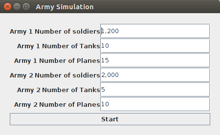
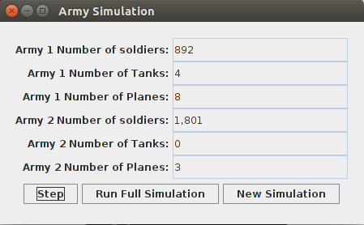

# Army Simulation

This program simulates two armies fighting each other, with each army having a certain number of foot soldiers, tanks, and planes. The simulation is turn based, with both armies inflicting damage on each other using a discretized set of first order differential Lanchaster equations. The randomness factor is simulated by slightly changing the output of the discretized equations using a randomly generated factor during each turn. The battle is ended when one army is completely defeated (all of its units are destroyed). This program has two modes: visual and command line. 

## Getting Started

These instructions will help you download and execute the program.

### Prerequisites

This code was developed in and tested using Java version "1.7.0_131". 

### Installation

Download the repository locally into an environment with a correct Java version installed. The javadocs can be accessed [here](docs/) once the code is downloaded locally. 
 
## Program Execution

A step by step series of how to get the program to execute.

#### Option 1: Use jar file

```
cd army-simulation-master/
java -jar ArmySimulation.jar 
```

#### Option 2: Compile and run manually

```
cd army-simulation-master/src/main
javac *.java
java ArmySimulationMain
```

## Using the Program

A series of steps on how to use the program once it is executed.

#### Visual

When prompted, choose visual mode.

```
Welcome to army simulation by Mohit Kohli!
Do you want to use visual mode? (Type Y or N)
>>> Y
```

In the following data entry screen that pops up, enter the amount of units for each category for both armies. The values must be non-negative integers.



In the following simulation window, you can click the 'Step' button to perform one turn in the battle. Clicking 'Run Full Simulation' will run all the turns until the battle is over.



Click 'New Simulation' to return to the data entry screen.

#### Command Line

When prompted, choose command line mode.

```
Welcome to army simulation by Mohit Kohli!
Do you want to use visual mode? (Type Y or N)
>>> N
```

You will be prompted to enter values describing the amount of each unit for each army. These values must be non-negative integers.

```
-------------------------------------
Command Line Simulation
-------------------------------------

How many foot soldiers are in army 1?
>>> 1200
How many tanks are in army 1?
>>> 10
How many planes are in army 1?
>>> 15
How many foot soldiers are in army 2?
>>> 2000
How many tanks are in army 2?
>>> 5
How many planes are in army 2?
>>> 10
```

The program will then simulate each turn on the command line until the battle is finished, printing the status of both armies for each turn.


## Authors

* **Mohit Kohli** - [MohitPKohli](https://github.com/MohitPKohli/)


## Acknowledgments

* [Lanchaster's Equations](https://en.wikipedia.org/wiki/Lanchester's_laws)

